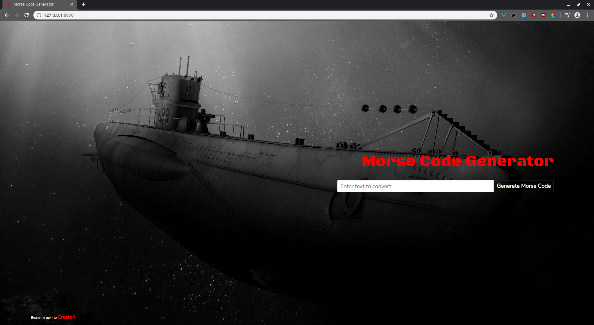

## Text To Morse Generator

Simple Text to Morse Generator with Visual and Audio representation of Morse Code:

## Youtube Video Demonstration

* [Youtube Link - TextToMorseGenerator](https://www.youtube.com/watch?v=p2nWCRV8SC8)

## Built With

* [Laravel - 7.x](https://laravel.com/) - Backend web framework used
* [Vue.js - 2.5.17](https://vuejs.org/) - Frontend web framework used
* [Howler.js - 2.13](https://howlerjs.com/) - Audio Library for Web

## Author

* **Damir Bubanović** - *Initial work* - [Github](https://github.com/damir-bubanovic)

## Creator Self Promo Links

Damir Bubanović

- **[GitHub](https://github.com/damir-bubanovic)**
- **[StackOwerflow](https://stackoverflow.com/users/11778242/damir-bubanovic)**
- **[Yahoo](damir.bubanovic@yahoo.com)**

## Acknowledgments

* Hat tip to anyone whose code was used
* Inspiration
* etc

